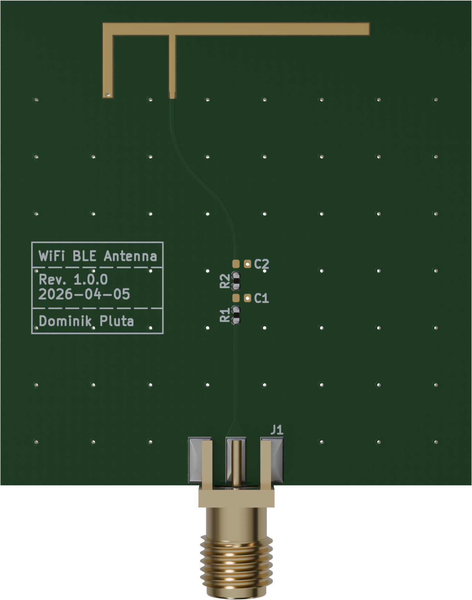
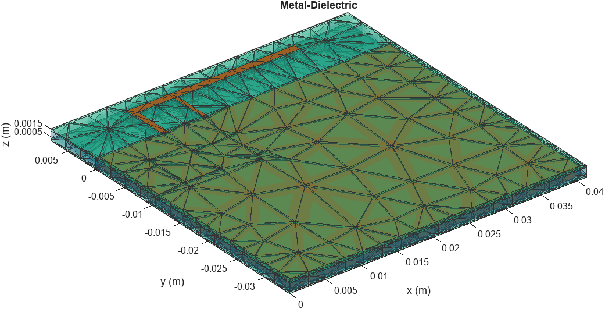
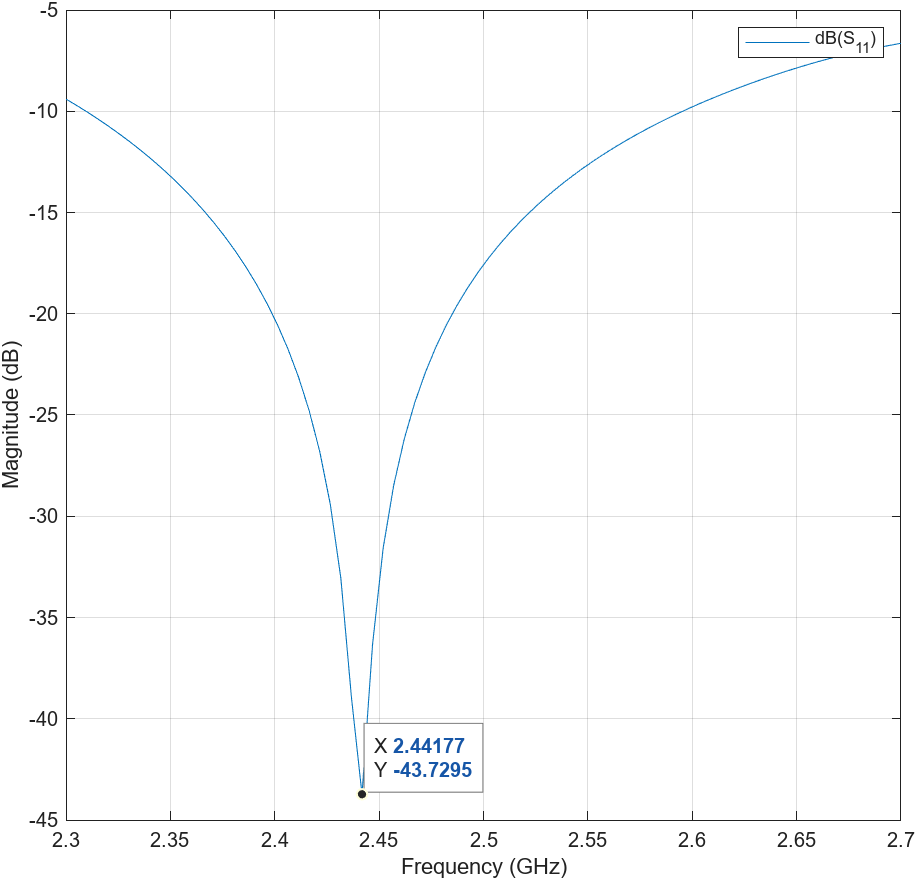
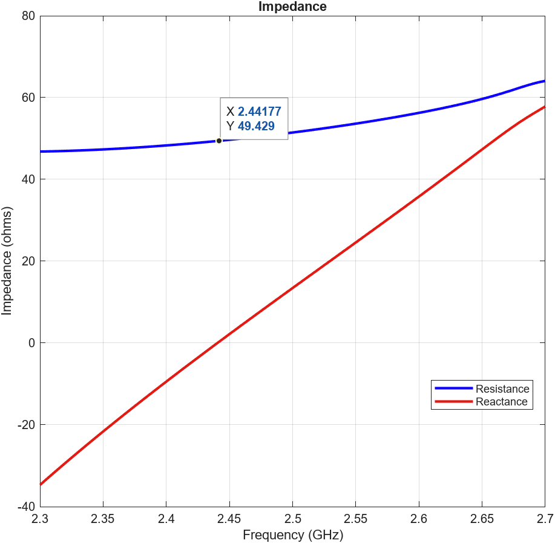
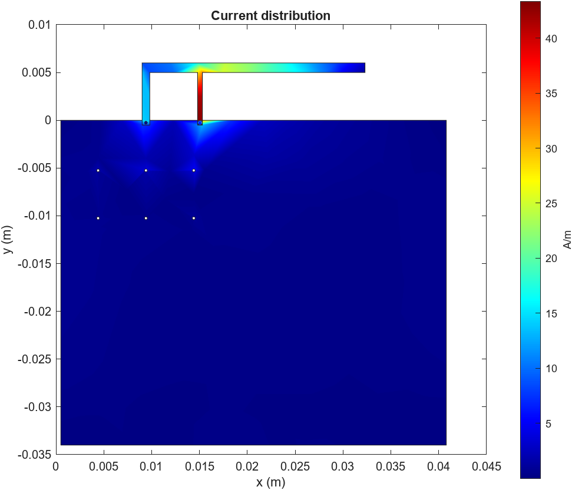
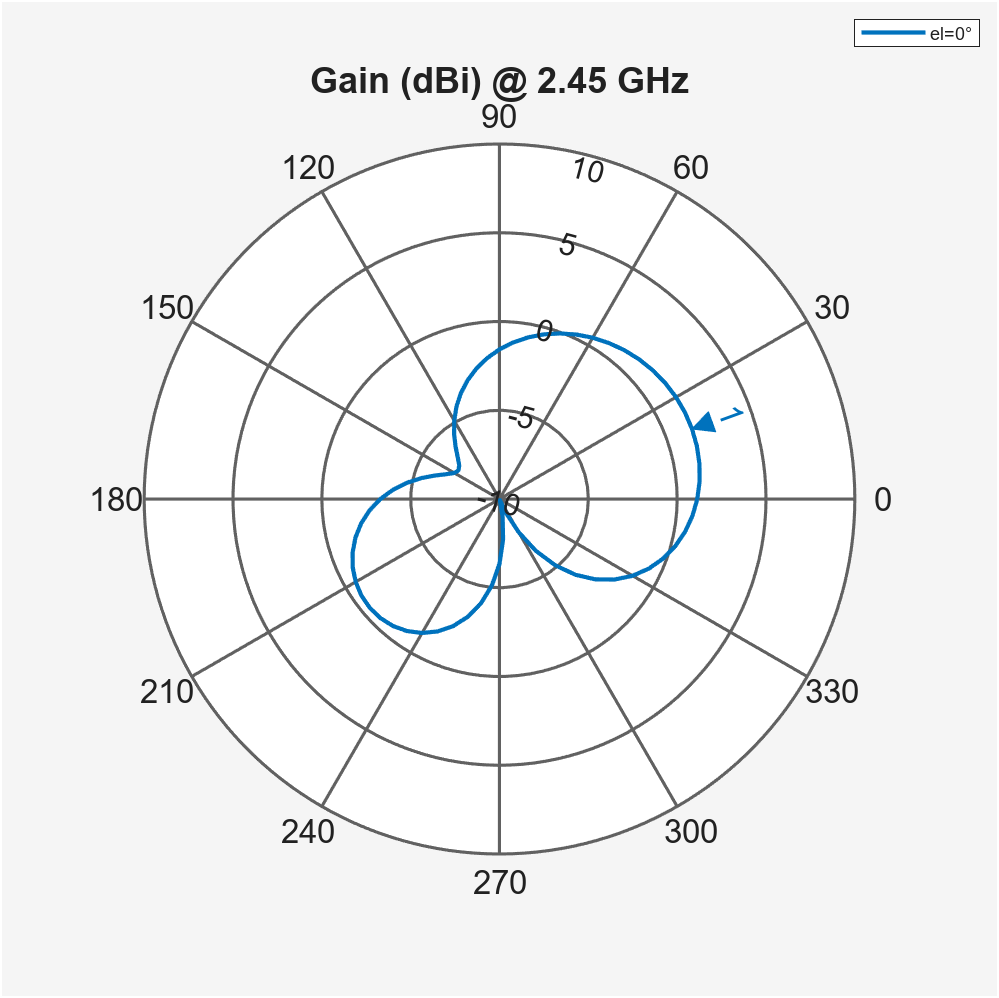
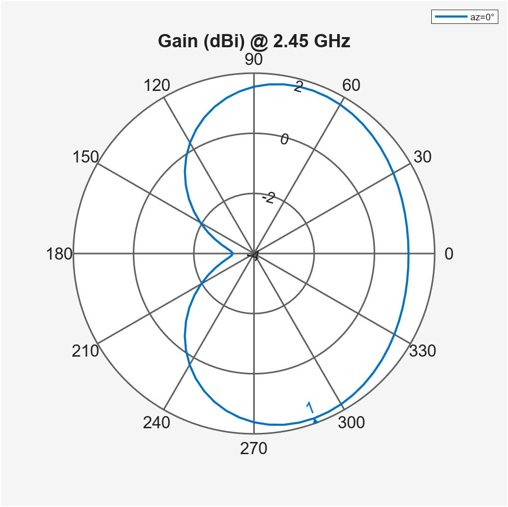

# WiFi BLE Antenna

 

  

## Antenna Design

Dimensioning of the antenna simulated in [antenna-design.mat](antenna-design.mat):

  

### Geometry Parameters
The following parameters (in mm) define the physical layout and PCB dimensions:

| Parameter | Value | Expression / Derived Value |
| :--- | :--- | :--- |
| **D1** | 9 | - |
| **D2** | 2 | - |
| **D3** | 9 | - |
| **D4** | 5 | - |
| **D5** | 17 | - |
| **D6** | 0.5 | - |
| **D7** | 34.5 | - |
| **W1** | 0.8 | - |
| **W2** | 0.5 | - |
| **W3** | 1 | - |
| **L1** | 5.5 | - |
| **L2** | 5.5 | - |
| **L3** | 23.3 | `W1 + D4 + W2 + D5` |
| **PCBwidth** | 42.5 | `D7 + L1 - D6 + W3 + D2` |
| **PCBlength** | 41.3 | `D1 + L3 + D3` |
| **CopperToEdge** | 0.5 | - |

## Simulation Results

### Mesh Settings

To ensure accurate simulation of the resonance and impedance, the following manual meshing parameters were used:

* **Max Edge Length:** `0.025 m` (25 mm)
* **Min Edge Length:** `0.004 m` (4 mm)
* **Growth Rate:** `0.4`

  

### Return Loss (S11) & Impedance (Z)

Simulated **2.3 - 2.7 GHz** range (`linspace(2.3, 2.7, 80)`):

  
  

### Current Distribution

Surface current distribution along the antenna traces at the target resonance:

  

### Radiation Pattern
2D Azimuth (AZ) and Elevation (EL) far-field radiation patterns:

  
  

## Project Status

**Design:** ✅ --> **Fabrication & Assembly:** ❌ --> **Bring-up:** ❌

The design is currently **untested and unverified**. Use at your own risk.
